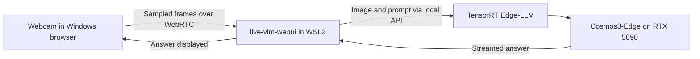

# Cosmos webcam demo on RTX 5090

A personal reproduction of an NVIDIA live vision-language-model demonstration,
inspired by an NVIDIA livestream. This repository packages the local setup,
launchers, measurement wrapper, and recorded results. The models, inference
backend, and web interface are NVIDIA projects; they were not developed here.

**NVIDIA Cosmos3-Edge → TensorRT Edge-LLM → NVIDIA live-vlm-webui**

Tested on a desktop RTX 5090 using Windows 11 and WSL2 Ubuntu 24.04.
No JetPack or substitute inference backend is used. Additionally, this consumes
less than 10gb of VRAM. Therefore, powerful GPUs are not required to test.

## Watch the demo

A 31-second recording of Cosmos3-Edge responding to live webcam frames on the
RTX 5090. The clip uses the prompt **"Describe what you see in this image in
one sentence."** The webcam feed, generated descriptions, and live performance
readings are visible. This is an exploratory scene-description demonstration.

https://github.com/user-attachments/assets/a5fa16df-8aec-493e-9f5c-0779c9364889

The player uses a compressed copy for quick loading.
[Download the full-quality cropped recording (MP4, 21.2 MB)](https://github.com/Derman0524/cosmos-webcam-demo/raw/refs/heads/main/media/cosmos3-edge.mp4).

## What it does

- Sends sampled webcam frames to the Cosmos3-Edge reasoning component.
- Displays short answers in NVIDIA's browser interface.
- Measures first-content-token and completed-response latency.
- Records whole-GPU memory usage while the backend runs.
- Provides start, stop, status, and fresh-install instructions.

Example prompt:

> Identify the object being held up to the camera. Reply with only its common
> name. If no object is held up, reply: no object.

This is an exploratory demo, not a validated inspection system. It answers
about individual sampled frames; the application does not provide persistent
visual memory, verified counting, or autonomous decisions.



## Run the existing installation

If the demo is already installed in the `Cosmos-Edge-2404` WSL distribution,
run these commands from PowerShell in this repository:

```powershell
& .\scripts\windows\Start-Cosmos-Webcam.ps1
```

Open **http://localhost:8090**, allow camera access, select a webcam, and press
**Start**. If necessary, set:

| Setting | Value |
|---|---|
| API base URL | `http://127.0.0.1:8000/v1` |
| Model | `nvidia/Cosmos3-Edge` |
| Frame interval used in the original demo | 30 |
| Output limit used in the original demo | 32 tokens |

The timing wrapper enforces a 32-token limit by default. The frontend's token
control does not override it; see [configuration](docs/CONFIGURATION.md).
The browser may restore a previous prompt, so re-enter the example above.

Stop both services and release the model's GPU allocations:

```powershell
& .\scripts\windows\Stop-Cosmos-Webcam.ps1
& .\scripts\windows\Status-Cosmos-Webcam.ps1
```

The webpage's Stop button stops camera streaming only. The installation is
preserved for the next run; the Windows launchers do not auto-start at login.

If script execution is restricted, the equivalent commands are:

```powershell
wsl -d Cosmos-Edge-2404 -u root --exec python3 /opt/cosmos-demo/manage_demo.py start
wsl -d Cosmos-Edge-2404 -u root --exec python3 /opt/cosmos-demo/manage_demo.py stop
```

## Install on another machine

Follow [SETUP.md](docs/SETUP.md). The installer targets the exact tested family:
**Ubuntu 24.04 / Python 3.12 / x86_64 / CUDA 13 / TensorRT 10 / SM120**.
It stops on compatibility failures and does not switch inference backends.

Model weights, TensorRT engines, virtual environments, and the WSL virtual disk
are intentionally not distributed. The installer downloads the pinned model
revision from NVIDIA's Hugging Face repository and builds engines locally.

## Recorded performance

Original interactive run: **30 September 2026**, RTX 5090, Logitech C525.

| Metric | Object prompt, 20 frames: median / p95 | Mixed prompts, 183 frames: median / p95 |
|---|---:|---:|
| HTTP request to first content token | 25.1 / 103.9 ms | 23.1 / 99.3 ms |
| HTTP request to final answer | 37.1 / 201.4 ms | 120.1 / 208.0 ms |
| JPEG preprocessing to final answer | 37.6 / 201.9 ms | 120.5 / 208.5 ms |

**These are not camera-to-screen timings.** Camera exposure, frame-sampling
wait, WebRTC transport into the frontend, and browser rendering are excluded.
Requests often arrived about two seconds apart with the original interval.
Frame resolution adapted during the session, so this is not a controlled
fixed-resolution throughput benchmark or an accuracy evaluation.

Whole-GPU memory during the live sample window had a median of **7.92 GiB**.
This includes Windows and other applications; it is not model-only VRAM.
The recorded build/startup peak was **18.75 GiB**.

See [methodology and limitations](docs/BENCHMARKS.md),
[aggregate results](results/2026-09-30/summary.json), and
[numeric per-frame results](results/2026-09-30/frame-timings.csv).

## Repository contents

| Path | Contents |
|---|---|
| `scripts/linux/` | Installation, model preparation, service launchers, timing tools |
| `scripts/windows/` | WSL start, stop, and status shortcuts |
| `requirements/` | Package snapshots from the working installation |
| `results/2026-09-30/` | Sanitized numeric data and summary |
| `media/` | Public demo recording |
| `docs/` | Setup, architecture, configuration, attribution, and limitations |
| `tests/` | Checks for service lifecycle, privacy defaults, and package consistency |

Fresh installations using this repository do not save webcam images or
generated scene descriptions by default. Local logs may still contain prompts
or upstream request details; review logs before sharing them. The historical
run used more verbose instrumentation; private raw logs and per-frame capture
files are not included here. The edited demo recording above is shared separately.

Run the packaging checks inside Linux/WSL without starting the model:

```bash
python3 -m unittest discover -s tests -v
python3 scripts/linux/summarize_public_results.py
```

## Credits and license

- [NVIDIA Cosmos3-Edge](https://huggingface.co/nvidia/Cosmos3-Edge)
- [NVIDIA TensorRT Edge-LLM](https://github.com/NVIDIA/TensorRT-Edge-LLM)
- [NVIDIA live-vlm-webui](https://github.com/NVIDIA-AI-IOT/live-vlm-webui)

The contribution here is local integration, launch automation, instrumentation,
and documentation. Preparation and troubleshooting were AI-assisted.
This is an independent personal project, not an official NVIDIA product or
an employer/client deliverable. See [attribution](docs/ATTRIBUTION.md).

Original repository glue and documentation are provided under the [MIT
License](LICENSE). Dependencies and model weights retain their own licenses;
this license does not relicense NVIDIA software, models, or branding.
